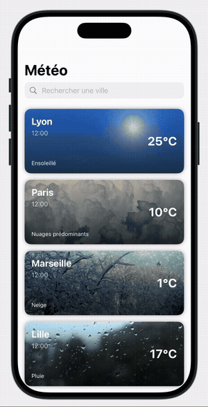
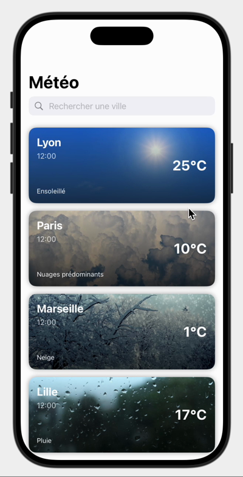
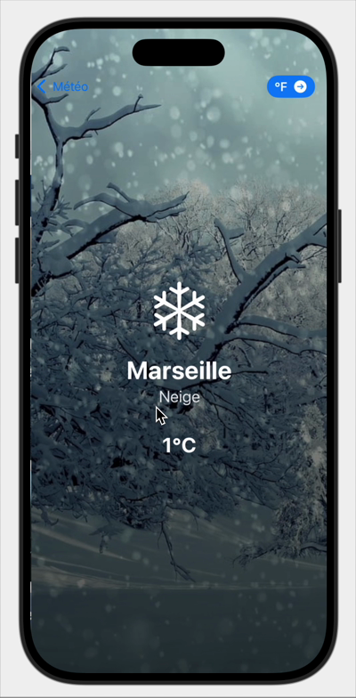
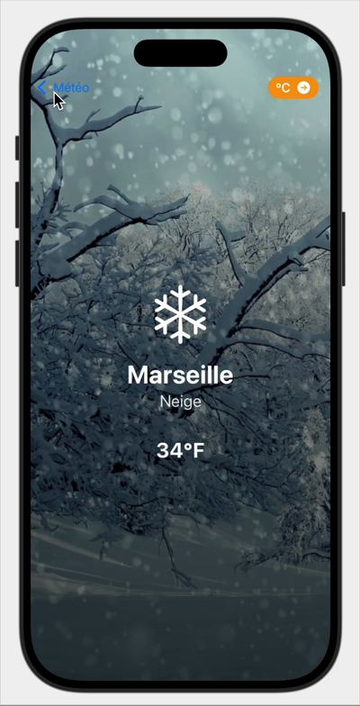

# 🌦️ Météo — SwiftUI

**Test technique : une application iOS qui affiche la météo en temps réel de plusieurs villes françaises, avec un fond animé selon le temps qu'il fait.**

 

## 📱 Aperçu

  
  &nbsp;
  
  &nbsp;
  

<i>Liste des villes · Détail d'une ville · Bascule °C / °F</i>

## ✨ Fonctionnalités

- Météo en temps réel de Lyon, Paris, Marseille, Lille et Toulouse via l'API OpenWeatherMap
- Fond illustré qui change selon le temps (soleil, nuages, pluie, neige…)
- Recherche d'une ville dans la liste
- Écran de détail avec conversion Celsius ↔ Fahrenheit
- Appels réseau asynchrones (`async/await`, `URLSession`)
- Architecture MVVM (Models / ViewModels / Views)

## 🛠️ Lancer le projet

1. Créer une clé gratuite sur [openweathermap.org](https://home.openweathermap.org/api_keys)
2. La coller dans `WeatherListViewModel.swift` à la place de `VOTRE_API_KEY`
3. Ouvrir le projet dans Xcode et lancer sur un simulateur (⌘R)

🎬 [Télécharger la vidéo de démo complète](./ScreenRecording_test.mp4)
